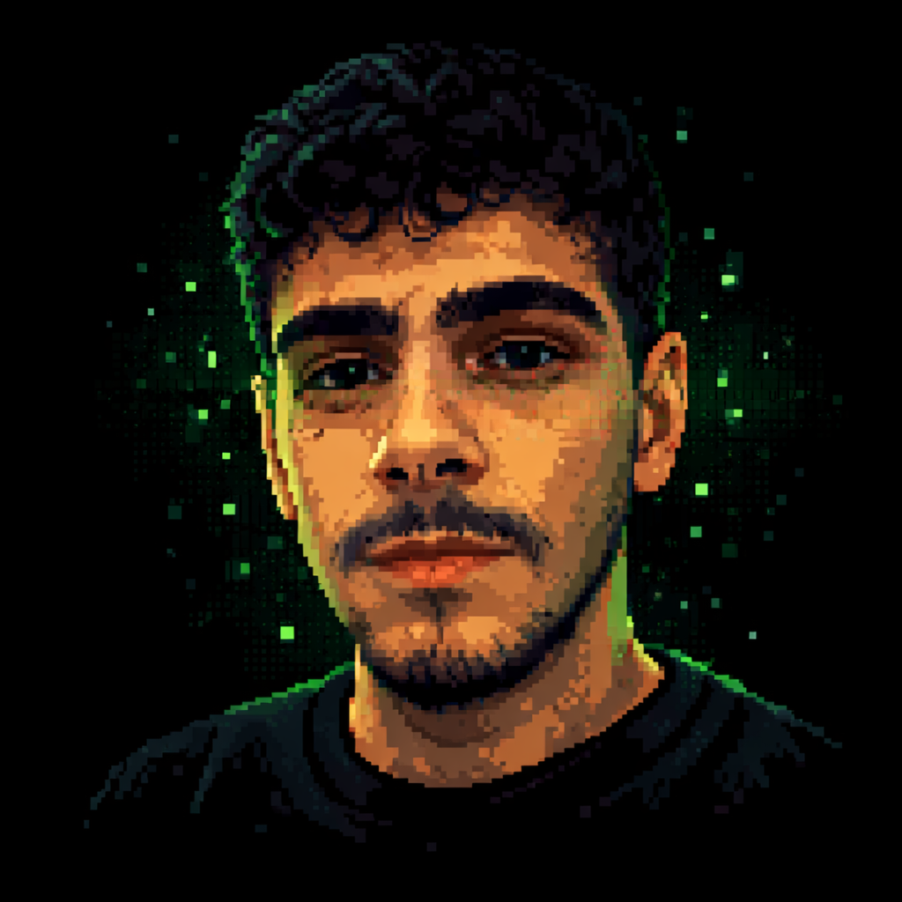
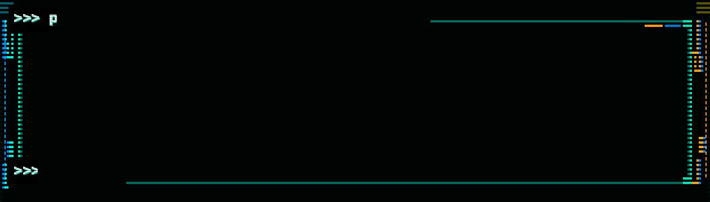

  

<h1 align="center">Pedro Henrique Silva Vargas</h1>

  
  

  
  
  
  

---

  

  
  
  
  

---

## 👨‍💻 Sobre mim

Sou estudante de **Engenharia de Software** na **PUC Minas** e técnico em **Eletroeletrônica** pelo **SENAI Itabirito**.

Busco oportunidades na área de Engenharia de Software para atuar com desenvolvimento de aplicações, integração entre componentes e melhoria de rotinas, contribuindo com entregas organizadas, versionadas e com foco em qualidade. Para mais informações, acesse meu portfólio: 

 

---

## 🎓 Formação acadêmica

- **PUC Minas** — Engenharia de Software *(2024 – em andamento)*
- **SENAI Itabirito** — Técnico em Eletroeletrônica *(2022 – 2023)*

---

## </> Linguagens e ferramentas

  

---

## 📦 Repositório em destaque

  <table align="center">
    <tr>
      <td align="center" valign="middle">
        
      </td>
      <td align="center" valign="middle">
        
      </td>
    </tr>
  </table>

---

## 📊 GitHub Stats

  

  
  
  

<h3 align="center">🔥 Sequência de commits diários</h3>

  Sequência atual e maior sequência de dias com contribuições no GitHub.

  

---

## 👾 Contribuições

> 

>   <picture>
>     <source
>       media="(prefers-color-scheme: dark)"
>       srcset="https://raw.githubusercontent.com/PHnsilva/PHnsilva/output/pacman-contribution-graph-dark.svg"
>     />
>     <source
>       media="(prefers-color-scheme: light)"
>       srcset="https://raw.githubusercontent.com/PHnsilva/PHnsilva/output/pacman-contribution-graph.svg"
>     />
>            alt="Pacman contribution graph"
>       src="https://raw.githubusercontent.com/PHnsilva/PHnsilva/output/pacman-contribution-graph.svg"
>       width="86%"
>     />
>   </picture>
> 

> 

>        src="https://ghchart.rshah.org/FF6D00/PHnsilva"
>     alt="GitHub contribution chart"
>     width="86%"
>   />
> 

> 

>   <picture>
>     <source
>       media="(prefers-color-scheme: dark)"
>       srcset="https://raw.githubusercontent.com/PHnsilva/PHnsilva/output/github-snake-dark.svg"
>     />
>     <source
>       media="(prefers-color-scheme: light)"
>       srcset="https://raw.githubusercontent.com/PHnsilva/PHnsilva/output/github-snake.svg"
>     />
>            alt="Snake contribution graph"
>       src="https://raw.githubusercontent.com/PHnsilva/PHnsilva/output/github-snake.svg"
>       width="86%"
>     />
>   </picture>
> 

<!--
---

## 🗓️ Retrospectiva

  

-->

---

---

## 📫 Contato

  Fale comigo pelos canais abaixo

<table align="center">
  <tr>
    <td align="center" width="25%">
      <a href="mailto:phnsilva1@gmail.com">
        
         
        <strong>Gmail</strong>
         
        phnsilva1@gmail.com
      </a>
    </td>
    <td align="center" width="25%">
      <a href="https://linkedin.com/in/PHnsilva1">
        
         
        <strong>LinkedIn</strong>
         
        /in/PHnsilva1
      </a>
    </td>
    <td align="center" width="25%">
      <a href="https://github.com/PHnsilva">
        
         
        <strong>GitHub</strong>
         
        @PHnsilva
      </a>
    </td>
    <td align="center" width="25%">
      <a href="https://wa.me/5531995438467">
        
         
        <strong>WhatsApp</strong>
         
        +55 31 99543-8467
      </a>
    </td>
  </tr>
</table>

 

  

