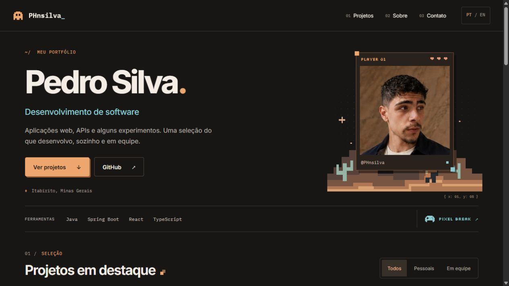
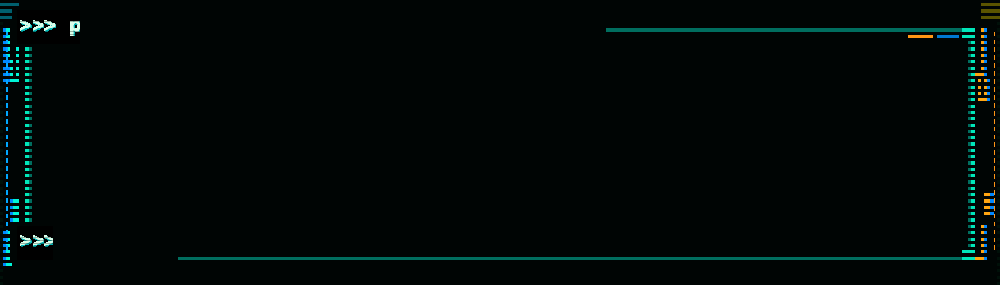

  

<h1 align="center">Pedro Henrique Silva Vargas</h1>

  
  

  
  
  
  

---

  

  
  
  
  

---

## 👨‍💻 Sobre mim

Sou estudante de **Engenharia de Software** na **PUC Minas** e técnico em **Eletroeletrônica** pelo **SENAI Itabirito**.

Desenvolvo aplicações web, APIs e experimentos pessoais, além de participar de projetos em equipe. Gosto de conectar interfaces, backend e integrações — e de deixar um pouco de jogos e terminal no que crio.

## 🕹️ Meu portfólio

**[Abrir portfólio →](https://portfolio-phnsilva.vercel.app)** · Capturas dos projetos, contexto de cada entrega e minha participação, em português e inglês.

### Projetos em destaque

| Projeto | O que desenvolvemos | Conheça |
| --- | --- | --- |
| **APAC Feminina** · em equipe | Gestão de medicamentos e acompanhamento clínico. Java, Spring Boot e Next.js. | [Apresentação](https://portfolio-phnsilva.vercel.app/projetos/apac-feminina) |
| **CalendarMate** · pessoal | Agenda de serviços, disponibilidade e integrações. Java, Spring Boot e React. | [Apresentação](https://portfolio-phnsilva.vercel.app/projetos/calendar-mate) · [Código](https://github.com/PHnsilva/CalendarMate) |
| **Meritum** · em equipe | Moeda estudantil e reconhecimento acadêmico. React, TypeScript, Fastify e Prisma. | [Apresentação](https://portfolio-phnsilva.vercel.app/projetos/meritum) · [Código](https://github.com/PHnsilva/Meritum) |
| **PsiHub** · em equipe | Plataforma web e mobile para psicólogos. Flutter, Dart e NestJS. | [Apresentação](https://portfolio-phnsilva.vercel.app/projetos/psihub) |
| **Sofiie** · pessoal | Assistente por texto e voz, com ações locais no desktop. TypeScript, Fastify e Tauri. | [Apresentação](https://portfolio-phnsilva.vercel.app/projetos/sofiie) · [Código](https://github.com/PHnsilva/Sofiie) |
| **SlothSignal** · pessoal | Serviço de notificações Web Push. TypeScript, Next.js e Supabase. | [Apresentação](https://portfolio-phnsilva.vercel.app/projetos/sloth-signal) · [Código](https://github.com/PHnsilva/SlothSignal) |

As apresentações detalham participação, estado e limites de cada projeto. APAC Feminina e PsiHub têm código em repositórios restritos.

---

## 🎓 Formação acadêmica

- **PUC Minas** — Engenharia de Software *(2024 – em andamento)*
- **SENAI Itabirito** — Técnico em Eletroeletrônica *(2022 – 2023)*

---

## </> Linguagens e ferramentas

Tecnologias que uso em projetos pessoais, acadêmicos e em equipe:

| Área | Tecnologias |
| --- | --- |
| Linguagens | Java, TypeScript, JavaScript, Python, C#, C, C++, Dart, Rust, HTML, CSS e SQL |
| Web, mobile e desktop | React, Next.js, Flutter, Tauri e Vite |
| Backend e APIs | Spring Boot, ASP.NET Core, NestJS, FastAPI, Fastify, Micronaut e Node.js |
| Dados e integrações | PostgreSQL, MongoDB, Supabase, Prisma, TypeORM, Entity Framework Core, RabbitMQ, Web Push e Google Calendar API |
| Ferramentas e entrega | Git, GitHub, Docker, GitHub Actions, Maven, Postman, Swagger/OpenAPI, Vercel e VS Code |
| Testes e qualidade | JUnit, Vitest, pytest, Playwright, Testing Library, Supertest, ESLint e Prettier |

[Explore as tecnologias no portfólio](https://portfolio-phnsilva.vercel.app/#ferramentas).

---

## 📊 GitHub Stats

  

  
  
  

<h3 align="center">🔥 Sequência de commits diários</h3>

  Sequência atual e maior sequência de dias com contribuições no GitHub.

  

---

## 👾 Contribuições

> 

>   <picture>
>     <source
>       media="(prefers-color-scheme: dark)"
>       srcset="https://raw.githubusercontent.com/PHnsilva/PHnsilva/output/pacman-contribution-graph-dark.svg"
>     />
>     <source
>       media="(prefers-color-scheme: light)"
>       srcset="https://raw.githubusercontent.com/PHnsilva/PHnsilva/output/pacman-contribution-graph.svg"
>     />
>            alt="Pacman contribution graph"
>       src="https://raw.githubusercontent.com/PHnsilva/PHnsilva/output/pacman-contribution-graph.svg"
>       width="86%"
>     />
>   </picture>
> 

> 

>        src="https://ghchart.rshah.org/FF6D00/PHnsilva"
>     alt="GitHub contribution chart"
>     width="86%"
>   />
> 

> 

>   <picture>
>     <source
>       media="(prefers-color-scheme: dark)"
>       srcset="https://raw.githubusercontent.com/PHnsilva/PHnsilva/output/github-snake-dark.svg"
>     />
>     <source
>       media="(prefers-color-scheme: light)"
>       srcset="https://raw.githubusercontent.com/PHnsilva/PHnsilva/output/github-snake.svg"
>     />
>            alt="Snake contribution graph"
>       src="https://raw.githubusercontent.com/PHnsilva/PHnsilva/output/github-snake.svg"
>       width="86%"
>     />
>   </picture>
> 

<!--
---

## 🗓️ Retrospectiva

  

-->

---

## 📫 Contato

<h3 align="center">Fale comigo</h3>

<table align="center">
  <tr>
    <td align="center" valign="top" width="220">
       
      <a href="mailto:phnsilva1@gmail.com">
        
          
        <strong>Gmail</strong>
         
        phnsilva1@gmail.com
      </a>
    </td>
    <td align="center" valign="top" width="220">
       
      <a href="https://linkedin.com/in/PHnsilva1">
        
          
        <strong>LinkedIn</strong>
         
        /in/PHnsilva1
      </a>
    </td>
    <td align="center" valign="top" width="220">
       
      <a href="https://wa.me/5531995438467">
        
          
        <strong>WhatsApp</strong>
         
        +55&nbsp;31&nbsp;99543&nbsp;8467
      </a>
    </td>
  </tr>
</table>

 

  

